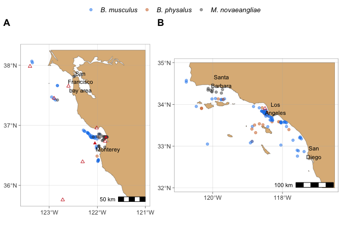

<!-- README.md is generated from README.Rmd. Please edit that file -->

# plasticmaps

``` r
library(plasticmaps)
#> Loading required package: tidyverse
#> ── Attaching packages ─────────────────────────────────────── tidyverse 1.3.0 ──
#> ✓ ggplot2 3.3.0     ✓ purrr   0.3.4
#> ✓ tibble  3.0.4     ✓ dplyr   1.0.2
#> ✓ tidyr   1.0.2     ✓ stringr 1.4.0
#> ✓ readr   1.3.1     ✓ forcats 0.4.0
#> ── Conflicts ────────────────────────────────────────── tidyverse_conflicts() ──
#> x dplyr::filter()  masks stats::filter()
#> x purrr::is_null() masks testthat::is_null()
#> x dplyr::lag()     masks stats::lag()
#> x dplyr::matches() masks tidyr::matches(), testthat::matches()
ggpubr::ggarrange(create_norcal_map(), 
                  create_socal_map(),
                  labels = c("A", "B"), 
                  widths = c(0.9, 1.1),
                  common.legend = TRUE,
                  ncol = 2, nrow = 1)
#> The map rotation currently works only for stereographic maps. Changed rotate to FALSE
#> The map rotation currently works only for stereographic maps. Changed rotate to FALSE
#> Warning: Removed 2 rows containing missing values (geom_point).

#> Warning: Removed 2 rows containing missing values (geom_point).

#> Warning: Removed 2 rows containing missing values (geom_point).
```


